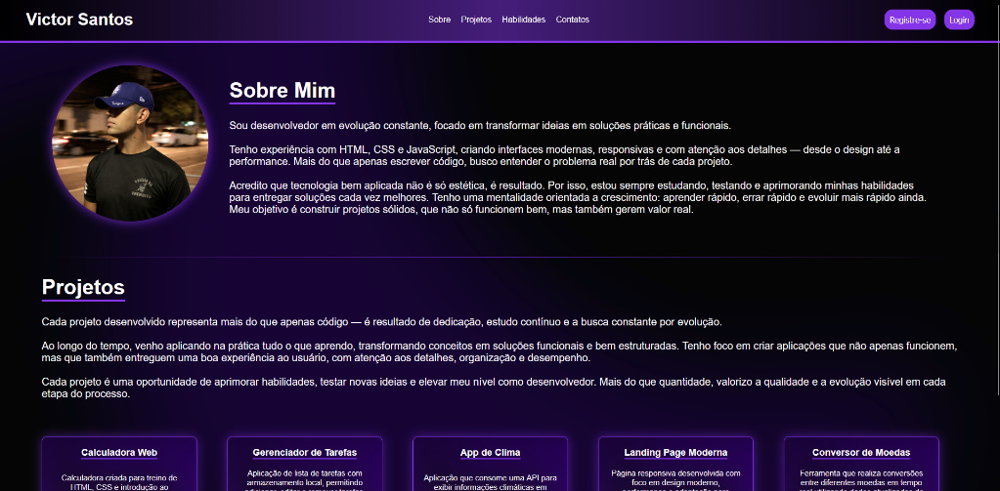

# 🚀 Portfolio Pessoal - Victor Santos

Bem-vindo ao repositório da minha Landing Page profissional. Este projeto foi desenvolvido para centralizar minha trajetória, portfólio de projetos e habilidades técnicas em uma interface moderna e de alta performance.

---

## 📝 Descrição do Projeto

Esta Landing Page utiliza uma estética **Dark Mode** com acentos em roxo neon, focando em uma experiência de usuário (UX) limpa e direta. O objetivo principal é demonstrar minhas competências em desenvolvimento Front-End e design de interface.

> "Focado em transformar ideias em soluções práticas e funcionais."

---

## 🛠️ Tecnologias e Ferramentas

* **HTML5 Semântico:** Estruturação focada em acessibilidade e SEO.
* **CSS3 Avançado:** Uso de variáveis, Flexbox e Grid.
* **Design System:** Paleta de cores contrastante para profissionalismo e modernidade.
* **Git & GitHub:** Controle de versão e deploy.

---

## 🚀 Funcionalidades Principais

* **Navegação Inteligente:** Menu fixo com âncoras para seções de Projetos e Contatos.
* **Cards de Projetos:** Exibição organizada de ferramentas como Calculadora Web, App de Clima e Conversores.
* **Responsividade:** Adaptado para leitura perfeita em qualquer tamanho de tela (Mobile-First).
* **Call to Action (CTA):** Botões destacados para registro e login, focados em conversão.

---

